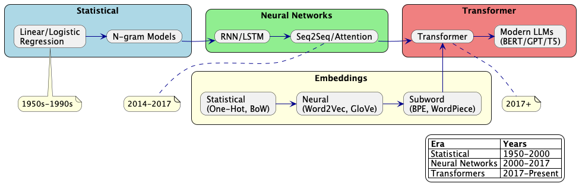

# From Linear Algebra to Large Language Models

This learning path takes you from fundamental mathematical concepts to understanding and implementing state-of-the-art Large Language Models.

## Phase 1: Mathematical Foundations (4-6 weeks)
- **Linear Algebra Essentials**
    - [MIT OpenCourseWare: Linear Algebra](https://ocw.mit.edu/courses/mathematics/18-06-linear-algebra-spring-2010/)
- **Calculus & Optimization**
    - [Khan Academy: Multivariable Calculus](https://www.khanacademy.org/math/multivariable-calculus)
    - [Stanford CS231n: Optimization](http://cs231n.stanford.edu/slides/2017/cs231n_2017_lecture3.pdf)
- **Probability & Statistics**
    - [Harvard Statistics 110](https://projects.iq.harvard.edu/stat110/home)
    - [Seeing Theory: Visual Introduction to Probability](https://seeing-theory.brown.edu/)

## Phase 2: Machine Learning Fundamentals (8 weeks)
- **Introduction to Machine Learning**
    - [Andrew Ng's Machine Learning Course](https://www.coursera.org/learn/machine-learning)
    - [Mathematics for Machine Learning](https://mml-book.github.io/)
- **Neural Networks**
    - [Deep Learning Specialization](https://www.deeplearning.ai/deep-learning-specialization/)
    - [Neural Networks and Deep Learning](http://neuralnetworksanddeeplearning.com/)

## Phase 3: Natural Language Processing (6 weeks)
- **NLP Foundations**
    - [Stanford CS224n: Natural Language Processing with Deep Learning](https://web.stanford.edu/class/cs224n/)
    - [Jurafsky & Martin: Speech and Language Processing](https://web.stanford.edu/~jurafsky/slp3/)
- **Word Embeddings & RNNs**
    - [Word2Vec Tutorial](http://jalammar.github.io/illustrated-word2vec/)
    - [Understanding LSTM Networks](http://colah.github.io/posts/2015-08-Understanding-LSTMs/)

## Phase 4: Transformer Architecture (4 weeks)
- **Attention Mechanism**
    - ["Attention Is All You Need" paper](https://arxiv.org/abs/1706.03762)
    - [The Illustrated Transformer](http://jalammar.github.io/illustrated-transformer/)
- **BERT & GPT Architectures**
    - [BERT Explained](http://jalammar.github.io/illustrated-bert/)
    - [The Illustrated GPT-2](http://jalammar.github.io/illustrated-gpt2/)

## Phase 5: Large Language Models (8 weeks)
- **Modern LLM Architectures**
    - [The Illustrated GPT-2](https://jalammar.github.io/illustrated-gpt2/)
    - [Hugging Face Blog: The Evolution of LLMs](https://huggingface.co/blog/large-language-models)
    - [LLaMA 2 Technical Report](https://arxiv.org/abs/2307.09288)
    - [Anthropic's Claude Technical Overview](https://www.anthropic.com/research)
    - [Stanford CS324: Large Language Models Course](https://stanford-cs324.github.io/winter2022/)
    - [Andrej Karpathy's "Let's build GPT" Video](https://www.youtube.com/watch?v=kCc8FmEb1nY)
    - [Papers with Code: Language Modeling](https://paperswithcode.com/task/language-modelling)
- **Training & Fine-tuning**
    - [Hugging Face Course](https://huggingface.co/course)
    - [Full Stack Deep Learning](https://fullstackdeeplearning.com/)
- **Prompting & Evaluation**
    - [Prompt Engineering Guide](https://www.promptingguide.ai/)
    - [HELM Benchmark](https://crfm.stanford.edu/helm/latest/)

## Phase 6: Advanced Topics & Projects (8+ weeks)
- **Practical Implementation**
    - [LLM From Scratch Tutorial](https://www.youtube.com/watch?v=kCc8FmEb1nY)
    - [Training LLMs using Pytorch](https://pytorch.org/tutorials/beginner/transformer_tutorial.html)
- **Research Directions**
    - [Parameter-Efficient Fine-Tuning](https://arxiv.org/abs/2203.15556)
    - [RLHF and Alignment](https://huggingface.co/blog/rlhf)
- **Capstone Project**
    - Implement a specialized LLM application
    - Fine-tune an open-source LLM for a specific domain

## Resources
- **Books**
    - "Deep Learning" by Goodfellow, Bengio, and Courville
    - "Natural Language Processing with Transformers" by Lewis Tunstall et al.
- **Communities**
    - [Hugging Face Forums](https://discuss.huggingface.co/)
    - [Kaggle](https://www.kaggle.com/)
